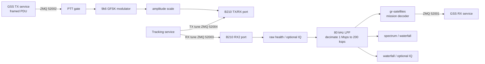

# MAV_DUO Flowgraph Handoff

This document explains how the MAVERIC ground-station radio flowgraph fits into
the web application, what each signal path does, and where to look when it does
not behave as expected. It describes the current `MAV_DUO.py` / `MAV_DUO.grc`
implementation for the USRP B210.

## What the flowgraph owns

`MAV_DUO` is the boundary between baseband samples on the B210 and packet PDUs
used by MAVERIC GSS. It owns:

- B210 RX and TX configuration;
- RX filtering, decimation, visualization, and gr-satellites decoding;
- modulation of already-framed uplink bytes;
- the external PA/coax-relay GPIO sequence;
- RX and TX Doppler tune-command inputs;
- waterfall, optional SigMF IQ, and radio-health instrumentation.

It does **not** build commands or apply MAVERIC's CSP and ASM+Golay framing.
Those steps happen in the mission command pipeline before the packet reaches
the flowgraph. On receive, gr-satellites removes the RF/outer framing and the
web backend interprets the resulting mission packet.

At a high level:



## How it is launched

The normal operator path is the web application's Radio tab. `RadioService`
starts the configured script as an external child process, captures combined
stdout/stderr, publishes status and logs to the browser, and records each run
under `<log_dir>/radio/`.

For MAVERIC, the mission seeds:

```yaml
platform:
  radio:
    script: gnuradio/MAV_DUO.py
    decoder_yml: gnuradio/decoders/MAVERIC_DECODER.yml
```

The effective launch is equivalent to:

```bash
python -u gnuradio/MAV_DUO.py
```

The child process runs with `gnuradio/` as its working directory. The service
therefore converts injected artifact and decoder paths to absolute paths.

`MAV_DUO` is a Qt flowgraph and opens its own window. The window contains RX
and TX gain controls, the achieved RX/TX center-frequency readouts, an RX
spectrum, an RX waterfall, and a TX spectrum. Closing the window, sending
SIGINT, or sending SIGTERM stops and waits for the GNU Radio graph before the
Qt process exits.

The Radio tab does not run GNU Radio Companion, regenerate the Python file, or
change the flowgraph's ownership or permissions. It only executes the existing
Python script.

## Startup configuration

`RadioService` translates the live platform and mission configuration into the
following environment variables before it starts the flowgraph:

| Variable | Purpose | MAVERIC fallback when run by hand |
|---|---|---:|
| `GSS_MISSION` | Mission name used for decoder selection and artifact names | `maveric` |
| `GSS_DECODER_YML` | Absolute gr-satellites decoder database override | `decoders/<MISSION>_DECODER.yml` |
| `GSS_RX_FREQ_HZ` | Nominal RX center frequency | 437.575 MHz |
| `GSS_TX_FREQ_HZ` | Nominal TX center frequency | 437.575 MHz |
| `GSS_RX_LO_OFFSET_HZ` | Parked RX RF-LO offset | +250 kHz |
| `GSS_TX_LO_OFFSET_HZ` | Parked TX RF-LO offset | -400 kHz |
| `GSS_RX_GAIN` | Initial B210 RX gain | 40 dB |
| `GSS_WATERFALL_DIR` | Waterfall output directory | `gnuradio/waterfalls/` |
| `GSS_IQ_RECORD` | Enables post-FIR 200 ksps SigMF recording | off |
| `GSS_IQ_RAW_RECORD` | Enables raw pre-FIR 1 Msps SigMF recording | off |
| `GSS_IQ_DIR` | SigMF output directory | `gnuradio/iq/` |
| `GSS_IQ_MAX_BYTES` | Per-run post-FIR capture cap | 8 GB |
| `GSS_IQ_RAW_MAX_BYTES` | Per-run raw capture cap | 50 GB |
| `GSS_BUILD_SHA` | Build provenance stored in SigMF metadata | unset |

The service also sets `UHD_LOG_FASTPATH_DISABLE=1`. UHD's unframed fast-path
characters would corrupt line-oriented logs; the flowgraph reports structured
RX and TX health instead.

The mission decoder selection fails closed. An explicit `GSS_DECODER_YML`
wins. Otherwise `decoder_profiles.py` requires the exact
`decoders/<MISSION>_DECODER.yml` file. It never silently falls back to the
MAVERIC decoder for another mission. AX100/FX.25 profiles receive
`--syncword_threshold 6`; profiles whose deframers do not support that option
are started without it.

## Hardware and fixed rates

The graph opens one RX channel and one TX channel on separate B210 RF
frontends. Logical channel 0 maps to frontend B for RX and frontend A for TX:

| Setting | RX | TX |
|---|---:|---:|
| UHD CPU format | complex float (`fc32`) | complex float (`fc32`) |
| Subdevice | `A:B` (RF B) | `A:A` (RF A) |
| Antenna port | `RX2` | `TX/RX` |
| Sample rate | 1 Msps | 2.4 Msps |
| Nominal RF | mission/config value | mission/config value |
| Initial hardware gain | configured RX gain | 0 dB idle |

The RX device time is set from host UTC immediately before streaming. SigMF
recorders use the first UHD `rx_time` stream tag to place sample zero precisely;
host time is only a construction fallback.

## Receive path

The B210 source produces a 1 Msps complex stream from RF B `RX2`.

1. The raw stream feeds `_StreamHealthMonitor`. Every ten seconds it reports
   RMS and peak dBFS, samples near full scale, and the cumulative overflow
   count as a `STREAM_HEALTH {json}` line. `RadioService` parses these lines
   into `/api/radio/status` and the Radio tab.
2. The raw stream also feeds the optional diagnostic IQ recorder. This is the
   only recording tap that preserves the full 1 MHz acquisition bandwidth.
3. A low-pass FIR with an 80 kHz cutoff and 15 kHz transition band decimates
   by five, producing the 200 ksps working stream.
4. The 200 ksps stream fans out to:
   - the mission-selected gr-satellites decoder;
   - the RX spectrum and live waterfall widgets;
   - `_WaterfallLogger`;
   - the optional post-FIR SigMF recorder.
5. Each decoded PDU is printed by a hexdump sink and published over ZMQ port
   52001. The GSS RX pipeline consumes it, parses the inner mission packet,
   logs it, updates parameters/alarms/plugins, and broadcasts it to the web UI.

For MAVERIC, `MAVERIC_DECODER.yml` defines one 9600-baud FSK transmitter with
3200 Hz peak deviation and `AX100 ASM+Golay` framing. The profile reflects the
flight AX100 Mode 5 downlink.

## Transmit path

The GSS TX service sends complete, mission-framed PDUs over ZMQ port 52002. For
MAVERIC, the bytes have already passed through:

```text
command wire format -> CSP v1 -> AX100 Mode 5 ASM+Golay
```

`MAV_DUO` handles each received PDU as follows:

1. A hexdump sink prints the submitted frame for the radio log.
2. `_PttGate` serializes the burst with every other PDU and keys the external
   relay/PA control lines.
3. After the relay lead interval, the PDU becomes a byte tagged stream.
4. The GFSK block unpacks the bytes and modulates at 9600 baud, 250 samples per
   symbol, Gaussian BT 0.5, and modulation index 2/3.
5. A complex multiplier applies the operator's TX amplitude setting (default
   0.7).
6. The stream feeds both the TX spectrum widget and the B210 RF A `TX/RX`
   port.

The TX gain slider is a **burst gain**, defaulting to 50 dB. Moving it changes
the value used at the next key-up; it does not raise the idle hardware gain.
The sink remains at 0 dB between packets to reduce TX LO leakage into the RX
passband.

### PTT and relay sequence

The station uses B210 front-panel GPIO to drive a complementary H-bridge pair
for the external PA/coax-relay chain. These are manual outputs, not UHD ATR.

| GPIO / J504 | Idle/RX | Live/TX | Role |
|---|---:|---:|---|
| GPIO0 / pin 1 | low | high | live control |
| GPIO1 / pin 2 | high | high | enable |
| GPIO2 / pin 3 | high | low | inverse control |
| GPIO3 / pin 4 | high | high | enable |

For every PDU, `_PttGate` performs this sequence under a lock:

1. Set GPIO0 high and GPIO2 low.
2. Wait 1.5 seconds for cold relay switching.
3. Raise B210 TX gain from 0 dB to the selected burst gain.
4. Release the PDU to the modulator.
5. Hold the TX state for calculated byte airtime plus a 0.2-second tail.
6. Restore gain to 0 dB **before** returning the GPIO pair to RX.

The `finally` path attempts the safe idle sequence even if a hardware call or
message operation fails. Hardware pull resistors must still establish the safe
RX state if the process or host dies before software cleanup can run: GPIO0 is
pulled down, GPIO2 is pulled up, and the enables are pulled to their chosen
safe state.

The sink's UHD async port feeds `_TxAsyncMonitor`. It reports cumulative
underflows, sequence errors, and time errors as `TX_HEALTH {json}` immediately
on an error and on a ten-second heartbeat. These values also appear in radio
status.

## Doppler tracking and parked LOs

Tracking publishes PMT tune dictionaries on two dedicated ZMQ channels:

| Port | Consumer |
|---:|---|
| 52003 | B210 RX source `command` port |
| 52004 | B210 TX sink `command` port |

The RF synthesizers are parked at nominal frequency plus their configured LO
offsets for the whole engagement. Once per tracking tick, only the DSP NCO is
moved to follow Doppler. This avoids repeated AD9361 PLL relock/calibration and
keeps RX DC and TX LO feedthrough away from the decoder band.

The tune command carries `lo_freq`, `dsp_freq`, and `chan=0`. The sign differs
by direction:

```text
RX: dsp_freq = parked_lo - desired_rx_frequency
TX: dsp_freq = desired_tx_frequency - parked_lo
```

Both IQ recorders receive the RX tune messages as well. They add sample-indexed
SigMF capture entries so an offline analyst can reconstruct frequency changes.
Live RX gain changes are recorded as SigMF annotations.

## Recorded products

### Waterfalls

`_WaterfallLogger` continuously consumes the post-FIR 200 ksps stream. It uses
1024-bin Blackman-Harris FFTs and averages 20 FFTs per row, producing about 9.8
timestamped rows per second. During a run, rows are appended to:

```text
<log_dir>/waterfalls/waterfall_<mission>_<UTC-start>.dat
```

On a clean stop, `waterfall_render.py` creates a SatNOGS-style PNG and deletes
the `.dat` file. If the process crashes or is killed, the `.dat` remains. The
next flowgraph start finds and renders leftover files in a background thread.
Waterfall failures disable only the recorder, never the radio path.

### IQ captures

IQ recording is optional because the files are large:

- `platform.radio.iq_record`: post-FIR 200 ksps complex-float SigMF, nominal
  8 GB cap (about 83 minutes);
- `platform.radio.iq_raw_record`: pre-FIR 1 Msps complex-float SigMF, nominal
  50 GB cap (about 8 MB/s).

`RadioService` checks free space before launch and preserves
`platform.radio.iq_disk_reserve_gb` (10 GB by default). If both products are
requested and space is constrained, it reduces their caps proportionally. If
no safe space remains, it disables recording for that run without preventing
the radio from starting.

Each capture has a `.sigmf-data` file and `.sigmf-meta` sidecar under
`<log_dir>/iq/`. Names are allocated exclusively, so a same-second restart
cannot append to an earlier run. The metadata includes mission, sample rate,
frequency/tune history, time anchors, RX gain history, LO offset, decoder
profile for the post-FIR tap, and build SHA when available.

The post-FIR recording can be replayed with the matching decoder profile:

```bash
gr_satellites decoders/MAVERIC_DECODER.yml --iq --samp_rate 200e3 \
  --rawfile <capture>.sigmf-data
```

## Stop, restart, and failure behavior

The web service sends SIGTERM first and waits up to
`platform.radio.stop_timeout_s` (30 seconds by default). The flowgraph signal
handler stops the scheduler and waits for block cleanup, which allows the PTT
gate to return idle and recorders to close/render. If the timeout expires, the
service sends SIGKILL. A forced kill cannot run cleanup; the physical GPIO
fail-safe and next-start waterfall recovery are therefore important.

Start, stop, and restart actions are serialized. A restart waits for the old
process's stdout reader, lifecycle logging, and exit callbacks to finish before
installing the replacement process. Each run's combined stdout/stderr is saved
as:

```text
<log_dir>/radio/radio_<mission>_<UTC-start>.log
```

The browser keeps only the configured in-memory tail (1000 lines by default),
so use the per-run log for full pass diagnostics.

## Operator checks

Before a pass:

1. Confirm the active mission and decoder profile printed at radio startup.
2. Confirm the configured RX/TX frequencies, RX gain, and parked LO offsets.
3. Start the radio and verify fresh `STREAM_HEALTH` and `TX_HEALTH` data.
4. Confirm the RX noise floor responds when the LNA path is changed; the health
   monitor is upstream of the FIR and is the best dead-front-end canary.
5. Engage Doppler and verify the tracking connection reports live while the RF
   LOs remain parked.
6. If IQ recording is required, verify the Radio tab's capture allocation and
   disk-reserve warning before AOS.
7. Exercise the relay chain only under the station's RF-safe test procedure;
   check the `[PTT]` log order: key, RF out, then RX restore.

After a pass:

1. Stop the radio cleanly and wait for the state to become stopped.
2. Check the run log for RX overflows, clipping, TX underflows, sequence errors,
   time errors, decoder errors, or a forced SIGKILL.
3. Confirm the waterfall PNG was rendered and any requested SigMF files have
   nonzero sizes and metadata sidecars.
4. If a `.dat` waterfall remains, preserve it; the next start will retry the
   render, or `waterfall_render.py` can be run directly.

## Troubleshooting map

| Symptom | First checks |
|---|---|
| Radio fails immediately | Read the first lines of the run log; verify B210 access, Qt/display access, Python environment, and the exact decoder YAML path. |
| Wrong mission decoder | Check `GSS_MISSION`, `platform.radio.decoder_yml`, and the startup line `MAV_DUO decoder database:`. There is no fallback to MAVERIC. |
| No packets, normal noise floor | Verify Doppler connection, nominal frequency, LO offsets, decoder profile, baud/deviation, and antenna path. |
| Flat or implausible noise floor | Check B210/LNA/coax power and `STREAM_HEALTH`; it measures the raw stream before filtering. |
| RX clipping | Reduce RX gain and inspect `peak_dbfs` / `clip_count`. The SigMF metadata will record live gain changes. |
| Increasing RX overflows | Check host USB throughput and load; raw and post-FIR IQ recording add disk pressure. |
| TX underflows or sequence errors | Inspect `TX_HEALTH`, host load, USB path, and whether simultaneous recording is saturating storage. |
| PTT stays in TX | Stop the radio, verify gain falls before GPIO returns to RX in the log, then inspect the H-bridge, relay wiring, and physical pull resistors before transmitting again. |
| Doppler moves the RF LO every second | Verify tracking sends manual `lo_freq` + `dsp_freq` commands and that service and flowgraph use the same LO-offset configuration. |
| Missing waterfall PNG | Look for a retained `.dat` and render errors in the run log; a later clean start retries orphan rendering. |
| IQ option enabled but no capture | Read the capture-storage status/warning and check free space above the configured reserve. |

## Editing and regeneration

`MAV_DUO.py` is the production executable used by the station, while
`MAV_DUO.grc` mirrors its block graph and hardware settings for GNU Radio
Companion. The current GRC does not encode the production `_PttGate` or GPIO
initialization, so **do not regenerate `MAV_DUO.py` from the GRC**: doing so
bypasses the relay sequencer and leaves the TX sink at its 0 dB idle gain.
Hardware-setting changes must be hand-applied to both files while preserving
the Python PTT path.

Supporting files used at runtime are:

- `decoder_profiles.py` for mission-specific decoder resolution;
- `decoders/<MISSION>_DECODER.yml` for gr-satellites demodulation/deframing;
- `waterfall_render.py` for post-pass PNG generation.

On Linux, the account running `MAV_WEB.py` needs read access to these files and
execute/search permission on their parent directories. It does not need to own
them. A mode such as `-rw-r--r--` is sufficient; owner-only `-rw-------` is not
when the station service runs as a different user.

After changing the flowgraph, verify at minimum:

1. the GRC and Python block graphs still match;
2. the relevant flowgraph/radio-service tests pass;
3. a B210 hardware smoke test starts and stops cleanly;
4. RX decode and TX loopback still work with the mission decoder/framer;
5. GPIO timing is observed on hardware before connection to the live PA and
   antenna chain.
